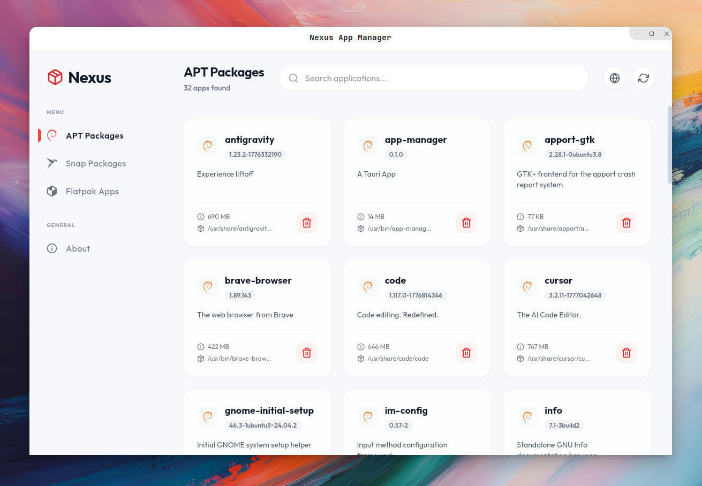
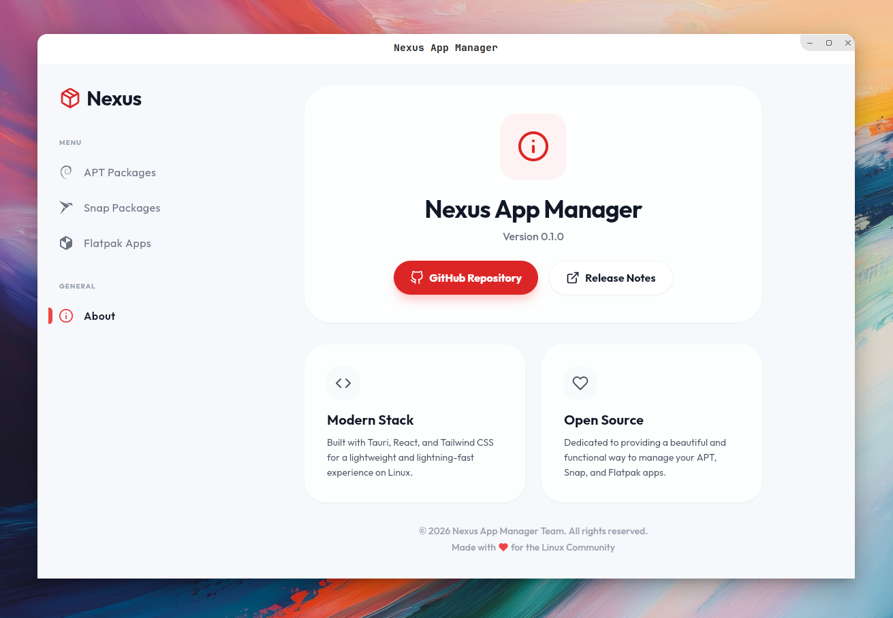

#  Nexus App Manager

**Nexus App Manager** is a modern, high-performance application manager for Linux distributions. Built with **Tauri 2** and **React**, it provides a unified, blazing-fast interface to manage **APT**, **Snap**, and **Flatpak** packages all in one place.



## Screenshots

| Main Dashboard | About Page |
| :---: | :---: |
|  |  |

## Key Features

- **Unified Management**: Handle APT, Snap, and Flatpak packages from a single dashboard.
- **Blazing Fast**: Optimized Rust backend with SQLite3 caching delivers near-instant load times (up to 10,000x faster for APT operations).
- **Modern UI**: A sleek, responsive interface featuring glassmorphism and intuitive navigation.
- **Global Search**: Search across all package managers simultaneously.
- **Smart Filtering**: Automatically filters out system packages to show only relevant desktop applications.
- **Safe & Secure**: Leverages Rust's memory safety and Tauri's secure IPC bridge.

## Tech Stack

- **Frontend**: React 18, Tailwind CSS, Vite
- **Backend**: Rust, Tauri 2
- **Database**: SQLite3 (via rusqlite)
- **Icons**: React Icons

## Getting Started

### Prerequisites

- [Rust](https://www.rust-lang.org/tools/install)
- [Node.js](https://nodejs.org/) (v18+)
- [Tauri Dependencies](https://tauri.app/v2/guides/getting-started/prerequisites/linux/)

### Installation

1. Clone the repository:
   ```bash
   git clone https://github.com/Huzaifa-code/Nexus-App-Manager.git
   cd nexus-app-manager
   ```

2. Install dependencies:
   ```bash
   npm install
   ```

3. Run in development mode:
   ```bash
   npm run tauri dev
   ```

## Documentation

- [Architecture Overview](ARCHITECTURE.md) - Deep dive into the system design and data flow.
- [Development & Debugging](DEVELOPMENT.md) - Technical notes on cache, icons, and debugging.

---

Built with ❤️ for the Linux Community.